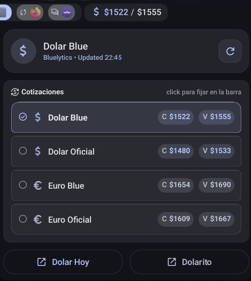

# Dolar Blue Plugin for DMS

A plugin that displays real-time Argentine exchange rates (Dolar Blue, Dolar Oficial, Euro Blue, and Euro Oficial) in the DMS bar.

> _"Argentina, you wouldn't understand..."_



## Features

- **Real-time exchange rates** from Bluelytics API
- **Multiple rate types**: Dolar Blue, Dolar Oficial, Euro Blue, Euro Oficial
- **Configurable refresh interval** (default: 10 minutes)
- **Comprehensive popup** showing all exchange rates at once
- **Buy and sell values** displayed for each rate type
- **Click a rate to pin it to the bar** — the one shown in the bar can be picked
  straight from the popup, not only from the settings screen
- **Header card** with the active rate, the source and the time of the last
  successful update
- **Auto-refresh** with configurable interval, plus a manual refresh whose
  spinner tracks the real request and raises a toast when it lands
- **Visible errors**: a failed request, a malformed response or a missing rate
  surfaces as an error card instead of leaving the widget on `...`
- **Customizable action buttons** in the popup (up to 2 buttons) that open URLs in your default browser

## Installation

```bash
mkdir -p ~/.config/DankMaterialShell/plugins/
git clone https://github.com/psyreactor/dms-dolarBlue.git dolarBlue
```

## Usage

1. Open DMS Settings <kbd>Super + ,</kbd>
2. Go to the "Plugins" tab
3. Enable the "Dolar Blue" plugin
4. Configure settings if needed (rate type, refresh interval)
5. Add the "dolarBlue" widget to your DankBar configuration

## Configuration

### Settings

- **Tipo de Cambio (Rate Type)**: Select which exchange rate to display in the bar
  - Dolar Blue (default)
  - Dolar Oficial
  - Euro Blue
  - Euro Oficial
- **Refresh Interval**: How often to update the exchange rates in minutes (default: 10, range: 1-60)
- **Button Text**: Text to display on the first action button in the popup (leave empty to hide)
- **Button URL**: URL to open when clicking the first button (e.g., https://dolarhoy.com)
- **Button 2 Text**: Text to display on the second action button in the popup (leave empty to hide)
- **Button 2 URL**: URL to open when clicking the second button
- **Time Format**: how the last-updated time is rendered in the popup header —
  system default, 12-hour or 24-hour

### Widget Display

The widget shows:
- **Bar**: Icon ($ or €) + Buy value + Sell value
- **Popup**:
  - A header card with the active rate, the source and the last-updated time
  - All four exchange rates (Dolar Blue, Dolar Oficial, Euro Blue, Euro Oficial)
    with buy and sell values. Clicking one makes it the rate shown in the bar;
    the active one is marked and not clickable
  - Up to 2 customizable action buttons (if configured) that open URLs in your default browser
  - Buttons are displayed side-by-side when both are configured, or full-width if only one is configured

## Files

- `plugin.json` - Plugin manifest and metadata
- `DolarBlueWidget.qml` - Main widget component
- `DolarBlueSettings.qml` - Settings interface
- `README.md` - This file

## Permissions

This plugin requires:
- `settings_read` - To read plugin configurations
- `settings_write` - To save plugin configurations

## API

This plugin uses the [Bluelytics API](https://bluelytics.com.ar/) to fetch real-time exchange rates:
- Endpoint: `https://api.bluelytics.com.ar/v2/latest`
- No API key required
- Returns JSON with current buy/sell values for all rate types

If the request fails, returns a non-200 status, or comes back without the
configured rate, the popup shows an error card explaining which of those
happened. A watchdog covers a request that never completes at all.

## Data Format

The API returns data in the following format:
```json
{
  "blue": {
    "value_buy": 1000.00,
    "value_sell": 1020.00
  },
  "oficial": {
    "value_buy": 800.00,
    "value_sell": 820.00
  },
  "blue_euro": {
    "value_buy": 1100.00,
    "value_sell": 1120.00
  },
  "oficial_euro": {
    "value_buy": 900.00,
    "value_sell": 920.00
  }
}
```

## Notes

- Exchange rates are specific to Argentina
- "Blue" rates refer to the unofficial/parallel market exchange rate
- "Oficial" rates refer to the official government exchange rate
- Rates are updated automatically based on the configured refresh interval
